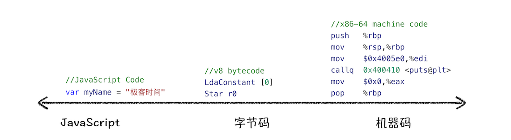

# JavaScript 内存机制
- 弱类型，意味着你不需要告诉 JavaScript 引擎这个或那个变量是什么数据类型，JavaScript 引擎在运行代码的时候自己会计算出来。
- 动态，意味着你可以使用同一个变量保存不同类型的数据。

静态语言 VS 动态语言
- 静态语言:在使用之前就需要确认其变量数据类型
- 动态语言:在运行过程中需要检查数据类型的语言

强类型语言 VS 弱类型语言
- 强类型语言：不支持隐式类型转换的语言称为强类型语言
- 弱类型语言： 支持隐式类型转换的语言称为弱类型语言

栈空间：储存原始类型 ；堆空间：储存引用类型。JavaScript 的变量是没有数据类型的，值才有数据类型，变量可以随时持有任何类型的数据

## 闭包如何产生
```js
function foo() {
    var myName = "极客时间"
    let test1 = 1
    const test2 = 2
    var innerBar = { 
        setName:function(newName){
            myName = newName
        },
        getName:function(){
            console.log(test1)
            return myName
        }
    }
    return innerBar
}
var bar = foo()
bar.setName("极客邦")
bar.getName()
console.log(bar.getName())
```
产生闭包的核心有两步：
- 第一步是需要预扫描内部函数；
- 第二步是把内部函数引用的外部变量保存到堆中：由于是内部函数引用了外部函数的变量，所以 JavaScript 引擎判断这是一个闭包，于是在堆空间创建换一个“closure(foo)”的对象（这是一个内部对象，JavaScript 是无法访问的），用来保存所引用的外部函数的变量。当执行到 foo 函数时，闭包就产生了，即使外部函数退出了，“ closure(foo)”依然被外部函数内部的方法引用。所以在下次调用外部函数返回的方法时，创建的执行上下文中就包含了“closure(foo)”。

chrome查询闭包：
1. 打开“开发者工具”
2. 在控制台执行上述代码
3. 然后选择“Memory”标签，点击"take snapshot" 获取V8的堆内存快照。
4. 然后“command+f"(mac) 或者 "ctrl+f"(win),搜索“setName”，然后你就会发现setName对象下面包含了 raw_outer_scope_info_or_feedback_metadata，对闭包的引用数据就在这里面。

## [完整copy对象](./copy%20object.js)
```js
let jack = {
    name : "jack.ma",
    age:40,
    like:{
        dog:{
            color:'black',
            age:3,
        },
        cat:{
            color:'white',
            age:2
        }
    }
}
function copy(src){
    let dest
    //实现拷贝代码，将src的值完整地拷贝给dest
   //在这里实现
    return dest
}
let jack2 = copy(jack)

//比如修改jack2中的内容，不会影响到jack中的值
jack2.like.dog.color = 'green'
console.log(jack.like.dog.color) //打印出来的应该是 "black"
```
# 垃圾回收机制
- 手动回收策略：如 C/C++ 就是使用手动回收策略，何时分配内存、何时销毁内存都是由代码控制的
- 自动垃圾回收策略：如 JavaScript、Java、Python 等语言，产生的垃圾数据是由垃圾回收器来释放的，并不需要手动通过代码来释放

## 调用栈中的数据是如何回收的？
当一个函数执行结束之后，JavaScript 引擎会通过向下移动 ESP （一个记录当前执行状态的指针）来销毁该函数保存在栈中的执行上下文。不需要启动v8的垃圾回收机制。
## 堆中的数据是如何回收的？（v8为例）
在 V8 中会把堆分为新生代和老生代两个区域，
- 新生代中存放的是生存时间短的对象；副垃圾回收器，主要负责新生代的垃圾回收，用Scavenge 算法。副垃圾回收器执行速度快，而且容易满，所以回收频率会比主垃圾回收器高。
- 老生代中存放的生存时间久的对象：主垃圾回收器，主要负责老生代的垃圾回收，用标记 - 清除（Mark-Sweep）/ 标记 - 整理（Mark-Compact）的算法
## 垃圾回收器的工作流程
1. 第一步是标记空间中活动对象和非活动对象。所谓活动对象就是还在使用的对象，非活动对象就是可以进行垃圾回收的对象。
2. 第二步是回收非活动对象所占据的内存。其实就是在所有的标记完成之后，统一清理内存中所有被标记为可回收的对象。
3. 第三步是做内存整理。一般来说，频繁回收对象后，内存中就会存在大量不连续空间，我们把这些不连续的内存空间称为内存碎片。当内存中出现了大量的内存碎片之后，如果需要分配较大连续内存的时候，就有可能出现内存不足的情况。所以最后一步需要整理这些内存碎片，但这步其实是可选的，因为有的垃圾回收器不会产生内存碎片，比如接下来我们要介绍的副垃圾回收器。

**现代的浏览器用闭包不会造成内存泄漏，因为垃圾回收是用的标记清除，没有被引用的闭包会被自动回收，不过如果没用的闭包还保存在全局变量中，依然会内存泄漏！**

*引用计数的垃圾回收方式：引用计数有问题，会导致内存泄漏，所以现在流行的垃圾回收器都没有采用引用计数的方式！*

## 全停顿（Stop-The-World）
JavaScript 是运行在主线程之上的，一旦执行垃圾回收算法，都需要将正在执行的 JavaScript 脚本暂停下来，待垃圾回收完毕后再恢复脚本执行。

增量标记（Incremental Marking）算法:为了降低老生代的垃圾回收而造成的卡顿，V8 将标记过程分为一个个的子标记过程，同时让垃圾回收标记和 JavaScript 应用逻辑交替进行，直到标记阶段完成，我们把这个算法称为增量标记（Incremental Marking）算法.

使用增量标记算法，可以把一个完整的垃圾回收任务拆分为很多小的任务，这些小的任务执行时间比较短，可以穿插在其他的 JavaScript 任务中间执行，这样当执行上述动画效果时，就不会让用户因为垃圾回收任务而感受到页面的卡顿了

## 如何判断 JavaScript 中内存泄漏的？
- 感官上的长时间运行页面卡顿，猜可能会有内存泄漏。
- 通过Chrome开发者工具中的Performance来观察内存变化 如果多次垃圾回收后，整体趋势是向上，就存在内部泄漏的可能！

# V8 中如何执行js代码
## 编译器（Compiler）VS 解释器（Interpreter）

编译型语言编写的程序： 在程序执行之前，需要经过编译器的编译过程（编译器首先会依次对源代码进行词法分析、语法分析，生成抽象语法树（AST），然后是优化代码，最后再生成处理器能够理解的机器码。如果编译成功，将会生成一个可执行的文件。但如果编译过程发生了语法或者其他的错误，那么编译器就会抛出异常，最后的二进制文件也不会生成成功），并且编译之后会直接保留机器能读懂的二进制文件，这样每次运行程序时，都可以直接运行该二进制文件，而不需要再次重新编译了。比如 C/C++、GO 等都是编译型语言。

解释型语言编写的程序：在每次运行时都需要通过解释器对程序进行动态解释和执行（同样解释器也会对源代码进行词法分析、语法分析，并生成抽象语法树（AST），不过它会再基于抽象语法树生成字节码（Bytecode），最后再根据字节码来执行程序、输出结果）。比如 Python、JavaScript 等都属于解释型语言。
## v8执行js代码流程图(V8 在执行过程中既有解释器 Ignition，又有编译器 TurboFan)

1. 生成抽象语法树（AST）和执行上下文

对于编译器或者解释器来说，它们可以理解的就是 AST 了。所以无论你使用的是解释型语言还是编译型语言，在编译过程中，它们都会生成一个 AST。这和渲染引擎将 HTML 格式文件转换为计算机可以理解的 DOM 树的情况类似。[JS AST的可视化工具](https://resources.jointjs.com/demos/javascript-ast)。有了 AST 后，那接下来 V8 就会生成该段代码的[执行上下文](./%E6%B5%8F%E8%A7%88%E5%99%A8%E4%B8%ADjs%E7%9A%84%E6%89%A7%E8%A1%8C%E6%9C%BA%E5%88%B6.md#编译阶段)。

*编译js的基本单位是全局代码，或者函数，比如下载完一个js文件，先编译这个js文件,但是js文件内定义的函数是不会编译的。等调用到该函数的时候，Javascript引擎才会去编译该函数！*

### AST的应用
AST 是非常重要的一种数据结构，在很多项目中有着广泛的应用。其中最著名的一个项目是 Babel。
- Babel 是一个被广泛使用的代码转码器，可以将 ES6 代码转为 ES5 代码，这意味着你可以现在就用 ES6 编写程序，而不用担心现有环境是否支持 ES6。Babel 的工作原理就是先将 ES6 源码转换为 AST，然后再将 ES6 语法的 AST 转换为 ES5 语法的 AST，最后利用 ES5 的 AST 生成 JavaScript 源代码。
- 除了 Babel 外，还有 ESLint 也使用 AST。ESLint 是一个用来检查 JavaScript 编写规范的插件，其检测流程也是需要将源码转换为 AST，然后再利用 AST 来检查代码规范化的问题。

### AST如何生成的（2个阶段）
1. 第一阶段是分词（tokenize），又称为词法分析。其作用是将一行行的源码拆解成一个个 token。所谓 token，指的是语法上不可能再分的、最小的单个字符或字符串。
2. 第二阶段是解析（parse），又称为语法分析，其作用是将上一步生成的 token 数据，根据语法规则转为 AST。如果源码符合语法规则，这一步就会顺利完成。但如果源码存在语法错误，这一步就会终止，并抛出一个“语法错误”。

2. 生成字节码(Ignition)
有了 AST 和执行上下文后，那接下来的第二步，解释器 Ignition 就登场了，它会根据 AST 生成字节码，并解释执行字节码。
> 字节码就是介于 AST 和机器码之间的一种代码。但是与特定类型的机器码无关，字节码需要通过解释器将其转换为机器码后才能执行。
> 机器码所占用的空间远远超过了字节码，所以使用字节码可以减少系统的内存使用。


3. 执行代码(Ignition + TurboFan)
解释器 Ignition 除了负责生成字节码之外，它还有另外一个作用，就是解释执行字节码。在 Ignition 执行字节码的过程中，如果发现有热点代码（HotSpot），比如一段代码被重复执行多次，这种就称为热点代码，那么后台的编译器 TurboFan 就会把该段热点的字节码编译为高效的机器码，然后当再次执行这段被优化的代码时，只需要执行编译后的机器码就可以了，这样就大大提升了代码的执行效率。

这种字节码配合解释器和编译器的技术叫即时编译（JIT）技术


*可以认为WebAssembly就是js的字节码（类似java一样先编译为字节码），WebAssembly经过TuboFan处理下就能执行了*
## JS的性能优化
应该将优化的中心聚焦在单次脚本的执行时间和脚本的网络下载上：
1. 提升单次脚本的执行速度，避免 JavaScript 的长任务霸占主线程，这样可以使得页面快速响应交互；
2. 避免大的同步的内联脚本（html里面的js代码），因为在解析 HTML 的过程中，解析和编译也会占用主线程；**同步脚本尽量小，尽量能内联。
其它的尽量采用异步脚本，如使用aysnc和defer**。
3. 减少 JavaScript 文件的容量，因为更小的文件会提升下载速度，并且占用更低的内存。

