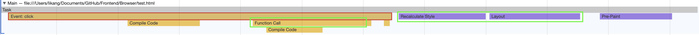
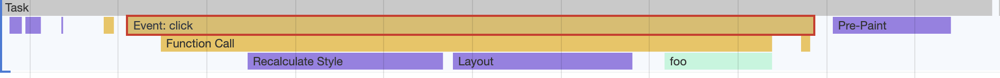
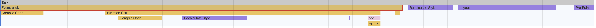
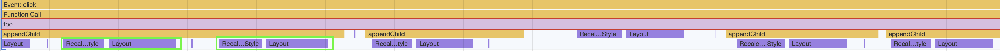

# Chrome Develop Tools

Network - 优化 timing 上的耗时项

1. queuing 排队时间过久：大概率是由浏览器为每个域名最多维护 6 个连接导致的

- 域名分片：可以让 1 个站点下面的资源放在多个域名下面，比如放到 3 个域名下面，这样就可以同时支持 18 个连接了
- 升级到 http2：HTTP2 已经没有每个域名最多维护 6 个 TCP 连接的限制了

2. 第一字节时间过久，可能的原因
   1. 服务器生成页面数据的时间过久 - 增加服务器缓存
   2. 网络的原因 - cdn 缓存一些静态文件
   3. 发送请求头时带上了多余的用户信息 - 发送请求时就去尽可能地减少一些不必要的 Cookie 数据信息
3. content download 时间过久：可能是字节数太多的原因导致的

- 减少文件大小，比如压缩、去掉源码中不必要的注释等方法

# DOM Tree

## DOM : 表述 html 的内部结构，将 web 页面和 js 脚本联系起来，过滤一些不安全的内容

## DOM Tree 生成（html parser 将字节流- tokenize-node-dom tree）

1. [网络进程接受到响应头](./%E6%B5%8F%E8%A7%88%E5%99%A8%E5%B7%A5%E4%BD%9C%E5%8E%9F%E7%90%86.md#从输入URL到页面展示完整流程示意图)之后,content-type 是 text/html。网络进程会为此选择或者创建一个渲染进程
2. 网络进程和渲染进程形成一个管道，渲染进程不断接受字节流，边接收边生成 dom tree

### js 脚本会影响 dom tree 的构建，同时 js 脚本会依赖样式表

- 如果生产 dom tree 期间遇到 js 脚本就先执行（inline script）或者下载（src）再执行，这会暂停 dom tree 的构建。解决方案：
  - cdn 来加速 js 文件的下载
  - 压缩 js 文件的体积
  - 异步加载 js 文件
    - async script：一旦加载完成，立即执行
    - defer script：加载完成之后，在 [DOMContentLoaded](https://developer.mozilla.org/en-US/docs/Web/API/Window/DOMContentLoaded_event) 之前执行
- 在执行 JavaScript 脚本之前，如果页面中包含了外部 CSS 文件的引用，或者通过 style 标签内置了 CSS 内容，那么渲染引擎还需要将这些内容转换为 CSSOM，因为 JavaScript 有修改 CSSOM （div.styles.color）的能力，所以在执行 JavaScript 之前，还需要依赖 CSSOM。也就是说 CSS 在部分情况下也会阻塞 DOM 的生成。

### 预解析操作：chrome 在 html 解析过程中的优化

当渲染进程接收 HTML 文件字节流时，会先开启一个预解析线程，如果遇到 JavaScript 文件或者 CSS 文件，那么预解析线程会提前下载这些数据，因此会同时发起这两个文件的下载请求，需要注意的是，这两个文件的下载过程是重叠的，所以下载时间按照最久的那个文件来算。不管 CSS 文件和 JavaScript 文件谁先到达，都要先等到 CSS 文件下载完成并生成 CSSOM，然后再执行 JavaScript 脚本，最后再继续构建 DOM，构建布局树，绘制页面。

# [渲染流水线](./%E6%B5%8F%E8%A7%88%E5%99%A8%E5%B7%A5%E4%BD%9C%E5%8E%9F%E7%90%86.md#渲染流程)

DOM 对应 html，CSSOM 对应 CSS，使得渲染进程能够根据 它能理解的 DOM 和 CSSOM 形成布局树。CSSOM 体现在 DOM 中的 document.styleSheets，因此也给了 js 可以操作样式表的能力。

## [白屏时间](./%E6%B5%8F%E8%A7%88%E5%99%A8%E5%B7%A5%E4%BD%9C%E5%8E%9F%E7%90%86.md#渲染流程)

包括了解析 HTML、下载 CSS、下载 JavaScript、生成 CSSOM、执行 JavaScript、生成布局树、绘制页面一系列操作.通常情况下的瓶颈主要体现在下载 CSS 文件、下载 JavaScript 文件和执行 JavaScript.所以要想缩短白屏时长，可以有以下策略：

- 通过内联 JavaScript、内联 CSS 来移除这两种类型的文件下载，这样获取到 HTML 文件之后就可以直接开始渲染流程了。
- 但并不是所有的场合都适合内联，那么还可以尽量减少文件大小，比如通过 webpack 等工具移除一些不必要的注释，并压缩 JavaScript 文件。
- 还可以将一些不需要在解析 HTML 阶段使用的 JavaScript 标记上 sync 或者 defer。
- 对于大的 CSS 文件，可以通过媒体查询属性，将其拆分为多个不同用途的 CSS 文件，这样只有在特定的场景下才会加载特定的 CSS 文件。

## 如何生成一帧图像

有[重排](./%E6%B5%8F%E8%A7%88%E5%99%A8%E5%B7%A5%E4%BD%9C%E5%8E%9F%E7%90%86.md#重排)、[重绘](./%E6%B5%8F%E8%A7%88%E5%99%A8%E5%B7%A5%E4%BD%9C%E5%8E%9F%E7%90%86.md#重绘)和合成三种方式.其中重排和重绘操作都是在渲染进程的主线程上执行的，比较耗时；而合成操作是在渲染进程的合成线程上执行的，执行速度快，且不占用主线程。

- 重排：它需要重新根据 CSSOM 和 DOM 来计算布局树，这样生成一幅图片时，会让整个渲染流水线的每个阶段都执行一遍，如果布局复杂的话，就很难保证渲染的效率了。
- 重绘：没有了重新布局的阶段，操作效率稍微高点，但是依然需要重新计算绘制信息，并触发绘制操作之后的一系列操作。
- 合成：并不需要触发布局和绘制两个阶段，如果采用了 GPU，那么合成的效率会非常高。

### chrome 对于合成图像的实现

总结；分层、分块和合成

[分层](./%E6%B5%8F%E8%A7%88%E5%99%A8%E5%B7%A5%E4%BD%9C%E5%8E%9F%E7%90%86.md#渲染流程)：

- 体现在生成布局树之后，渲染引擎会根据布局树的特点将其转换为层树（Layer Tree），层树是渲染流水线后续流程的基础结构。层树中的每个节点都对应着一个图层，下一步的绘制阶段就依赖于层树中的节点。
- 绘制阶段其实并不是真正地绘出图片，而是将绘制指令组合成一个列表.
- 有了绘制列表之后，就需要进入光栅化阶段了，光栅化就是按照绘制列表中的指令生成图片。每一个图层都对应一张图片，合成线程有了这些图片之后，会将这些图片合成为“一张”图片，并最终将生成的图片发送到后缓冲区。这就是一个大致的分层、合成流程。

需要重点关注的是，合成操作是在合成线程上完成的，这也就意味着在执行合成操作时，是不会影响到主线程执行的。这就是为什么经常主线程卡住了，但是 CSS 动画依然能执行的原因。

分块
通常情况下，页面的内容都要比屏幕大得多，显示一个页面时，如果等待所有的图层都生成完毕，再进行合成的话，会产生一些不必要的开销，也会让合成图片的时间变得更久。因此，合成线程会将每个图层分割为大小固定的图块，然后**优先绘制靠近视口的图块**，这样就可以大大加速页面的显示速度。不过有时候， 即使只绘制那些优先级最高的图块，也要耗费不少的时间，因为涉及到一个很关键的因素——纹理上传，这是因为从计算机内存上传到 GPU 内存的操作会比较慢。
为了解决这个问题，Chrome 又采取了一个策略：在**首次合成图块的时候使用一个低分辨率的图片**。比如可以是正常分辨率的一半，分辨率减少一半，纹理就减少了四分之三。在首次显示页面内容的时候，将这个低分辨率的图片显示出来，然后合成器继续绘制正常比例的网页内容，当正常比例的网页内容绘制完成后，再替换掉当前显示的低分辨率内容。这种方式尽管会让用户在开始时看到的是低分辨率的内容，但是也比用户在开始时什么都看不到要好。

### 利用分层技术优化代码

如果使用 JavaScript 来对某个元素做几何形状变换、透明度变换或者一些缩放操作，会牵涉到整个渲染流水线，所以 JavaScript 的绘制效率会非常低下。will-change 就是提前告诉渲染引擎 box 元素将要做几何变换和透明度变换操作，这时候渲染引擎会将该元素单独实现一帧，等这些变换发生时，渲染引擎会通过合成线程直接去处理变换，这些变换并没有涉及到主线程，这样就大大提升了渲染的效率。这也是 CSS 动画比 JavaScript 动画高效的原因。

如果涉及到一些可以使用合成线程来处理 CSS 特效或者动画的情况，就尽量使用 [will-change](https://developer.mozilla.org/en-US/docs/Web/CSS/will-change) 来提前告诉渲染引擎，让它为该元素准备独立的层。但是凡事都有两面性，每当渲染引擎为一个元素准备一个独立层的时候，它占用的内存也会大大增加，因为从层树开始，后续每个阶段都会多一个层结构，这些都需要额外的内存，所以你需要恰当地使用 will-change。

**能直接在合成线程中完成的任务都不会改变图层的内容，如文字信息的改变，布局的改变，颜色的改变，统统不会涉及，涉及到这些内容的变化就要牵涉到重排或者重绘了。能直接在合成线程中实现的是整个图层的几何变换，透明度变换，阴影等，这些变换都不会影响到图层的内容。**

比如滚动页面的时候，整个页面内容没有变化，这时候做的其实是对图层做上下移动，这种操作直接在合成线程里面就可以完成了。

再比如文章题目列子中的旋转操作，如果样式里面使用了 will-change ，那么这些 box 元素都会生成单独的一层，那么在旋转操作时，只要在合成线程将这些 box 图层整体旋转到设置的角度，再拿旋转后的 box 图层和背景图层合成一张新图片，这个图片就是最终输出的一帧，整个过程都是在合成线程中实现的。

# 系统的优化页面（加载->交互->结束）

## 页面加载阶段


能阻塞网页首次渲染的资源称为关键资源：JavaScript、首次请求的 HTML 资源文件、CSS 文件是会阻塞首次渲染的，因为在构建 DOM 的过程中需要 HTML 和 JavaScript 文件，在构造渲染树的过程中需要用到 CSS 文件

- 减少关键资源个数
  - 将 js 和 css 写成內联样式
  - 没有 dom 或者 cssom 操作的 js 添加 async 或者 defer
  - [css link 添加 media](https://developer.mozilla.org/en-US/docs/Learn/Performance/CSS#optimizing_for_render_blocking)
- 减少关键资源大小；压缩 css js 文件，清理 html css js 的注释
- 减少请求关键资源的 RTT（Round Trip Time）：cdn

非关键资源：图片、音频、视频等文件就不会阻塞页面的首次渲染

## 页面交互阶段


交互阶段没有关键资源的下载，主要是 js 脚本修改 dom 或者 cssom 触发新的一帧，或者是通过 CSS 实现一些变形、渐变、动画等特效，这是由 CSS 触发的，并且是在合成线程上执行的，这个过程称为合成。因为它不会触发重排或者重绘，而且合成操作本身的速度就非常快，所以执行合成是效率最高的方式。

> 优化的大原则就是：让单个帧的生成速度变快。
>
> 1. 减少 js 脚本的执行时间，不让 js 脚本一次性霸占太久进程
>
> - 将一次执行的函数分解为多个任务，使得每次的执行时间不要过久。(todo 老王讲过)
> - 采用 Web Workers。你可以把 Web Workers 当作主线程之外的一个线程，在 Web Workers 中是可以执行 JavaScript 脚本的，不过 Web Workers 中没有 DOM、CSSOM 环境，这意味着在 Web Workers 中是无法通过 JavaScript 来访问 DOM 的，所以我们可以把一些和 DOM 操作无关且耗时的任务放到 Web Workers 中去执行

> 2. 避免强制同步

> 正常情况下的布局操作是：js 通过 dom 接口添加或删除元素后，是需要重新计算样式和布局的

```html
<html>
  <body>
    <div id="mian_div">
      <li id="time_li">time</li>
      <li>geekbang</li>
    </div>

    <p id="demo">强制布局demo</p>
    <button onclick="foo()">添加新元素</button>

    <script>
      function foo() {
        let main_div = document.getElementById('mian_div');
        let new_node = document.createElement('li');
        let textnode = document.createTextNode('time.geekbang');
        new_node.appendChild(textnode);
        document.getElementById('mian_div').appendChild(new_node);
      }
    </script>
  </body>
</html>
```

performance 可以看到 js 脚本的执行和样式的重新计算是分开的


> 所谓强制同步布局，是指 JavaScript 强制将计算样式和布局操作提前到当前的任务中
> 将新的元素添加到 DOM 之后，我们又调用了 main_div.offsetHeight 来获取新 main_div 的高度信息。如果要获取到 main_div 的高度，就需要重新布局，所以这里在获取到 main_div 的高度之前，JavaScript 还需要强制让渲染引擎默认执行一次布局操作。我们把这个操作称为强制同步布局。

```js
function foo() {
  let main_div = document.getElementById('mian_div');
  let new_node = document.createElement('li');
  let textnode = document.createTextNode('time.geekbang');
  new_node.appendChild(textnode);
  document.getElementById('mian_div').appendChild(new_node);
  //由于要获取到offsetHeight，
  //但是此时的offsetHeight还是老的数据，
  //所以需要立即执行布局操作
  console.log(main_div.offsetHeight);
}
```

performance 可以看到 js 脚本执行的过程中伴随着 layout。


> 为了避免强制同步布局，我们可以调整策略，在修改 DOM 之前查询相关值

```js
function foo() {
  let main_div = document.getElementById('mian_div');
  //为了避免强制同步布局，在修改DOM之前查询相关值
  console.log(main_div.offsetHeight);
  let new_node = document.createElement('li');
  let textnode = document.createTextNode('time.geekbang');
  new_node.appendChild(textnode);
  document.getElementById('mian_div').appendChild(new_node);
}
```

performance 可以看到 layout 在 js 脚本执行之后了。


> 3. 避免布局抖动

> 还有一种比强制同步布局更坏的情况，那就是布局抖动。所谓布局抖动，是指在一次 JavaScript 执行过程中，多次执行强制布局和抖动操作

> 因此避免强制同步布局和布局抖动都是尽量不要在修改 DOM 结构时再去查询一些相关值。

```html
<html>
  <body>
    <div id="mian_div">
      <li id="time_li">time</li>
      <li>geekbang</li>
    </div>

    <p id="demo">强制布局demo</p>
    <button onclick="foo()">添加新元素</button>

    <script>
      function foo() {
        let time_li = document.getElementById('time_li');
        for (let i = 0; i < 100; i++) {
          let main_div = document.getElementById('mian_div');
          let new_node = document.createElement('li');
          let textnode = document.createTextNode('time.geekbang');
          new_node.appendChild(textnode);
          new_node.offsetHeight = time_li.offsetHeight;
          document.getElementById('mian_div').appendChild(new_node);
        }
      }
    </script>
  </body>
</html>
```

performance 可以看到在一段 js 中反复执行布局操作就叫做布局抖动


> 4.合理利用 css 动画

> 合成动画是直接在合成线程上执行的，这和在[主线程](./浏览器工作原理.md#渲染流程)上执行的布局、绘制等操作不同，如果主线程被 JavaScript 或者一些布局任务占用，CSS 动画依然能继续执行。所以要尽量利用好 CSS 合成动画，如果能让 CSS 处理动画，就尽量交给 CSS 来操作。另外，如果能提前知道对某个元素执行动画操作，那就最好将其标记为 will-change，这是告诉渲染引擎需要将该元素单独生成一个图层。

> 5.避免频繁的垃圾回收

> JavaScript 使用了自动垃圾回收机制，如果在一些函数中频繁创建临时对象，那么垃圾回收器也会频繁地去执行垃圾回收策略。这样当垃圾回收操作发生时，就会占用主线程，从而影响到其他任务的执行，严重的话还会让用户产生掉帧、不流畅的感觉。所以要尽量避免产生那些临时垃圾数据。

> 那该怎么做呢？可以尽可能优化储存结构，尽可能避免小颗粒对象的产生。

## 优化页面 summary

在加载阶段，核心的优化原则是：优化关键资源的加载速度，减少关键资源的个数，降低关键资源的 RTT 次数。

在交互阶段，核心的优化原则是：尽量减少一帧的生成时间。可以通过减少单次 JavaScript 的执行时间、避免强制同步布局、避免布局抖动、尽量采用 CSS 的合成动画、避免频繁的垃圾回收等方式来减少一帧生成的时长。

# React 虚拟 dom

## 虚拟 dom 如何运行

1. 创建阶段。首先依据 JSX 和基础数据创建出来虚拟 DOM，它反映了真实的 DOM 树的结构。然后由虚拟 DOM 树创建出真实 DOM 树，真实的 DOM 树生成完后，再触发渲染流水线往屏幕输出页面。
2. 更新阶段。如果数据发生了改变，那么就需要根据新的数据创建一个新的虚拟 DOM 树；然后 React 比较两个树，找出变化的地方，并把变化的地方一次性更新到真实的 DOM 树上；最后渲染引擎更新渲染流水线，并生成新的页面。

### React Fiber reconciliation

#### Stack reconciler

比较两个虚拟 DOM 的过程是在一个递归函数里执行的，其核心算法是 reconciliation。通常情况下，这个比较过程执行得很快，不过当虚拟 DOM 比较复杂的时候，执行比较函数就有可能占据主线程比较久的时间，这样就会导致其他任务的等待，造成页面卡顿。为了解决这个问题，React 团队重写了 reconciliation 算法，新的算法称为 Fiber reconciler，之前老的算法称为 Stack reconciler。

#### Fiber reconciler

其实协程的另外一个称呼就是 Fiber，所以在这里我们可以把 Fiber 和协程关联起来，那么所谓的 Fiber reconciler 相信你也很清楚了，就是在执行算法的过程中出让主线程，这样就解决了 Stack reconciler 函数占用时间过久的问题

## 虚拟 dom 背后的理念：双缓存+mvc 模式

可以把虚拟 DOM 看成是 DOM 的一个 buffer，和图形显示一样，它会在完成一次完整的操作之后，再把结果应用到 DOM 上，这样就能减少一些不必要的更新，同时还能保证 DOM 的稳定输出。

MVC 的整体结构比较简单，由模型、视图和控制器组成，其核心思想就是将数据和视图分离，也就是说视图和模型之间是不允许直接通信的，它们之间的通信都是通过控制器来完成的。通常情况下的通信路径是视图发生了改变，然后通知控制器，控制器再根据情况判断是否需要更新模型数据。
